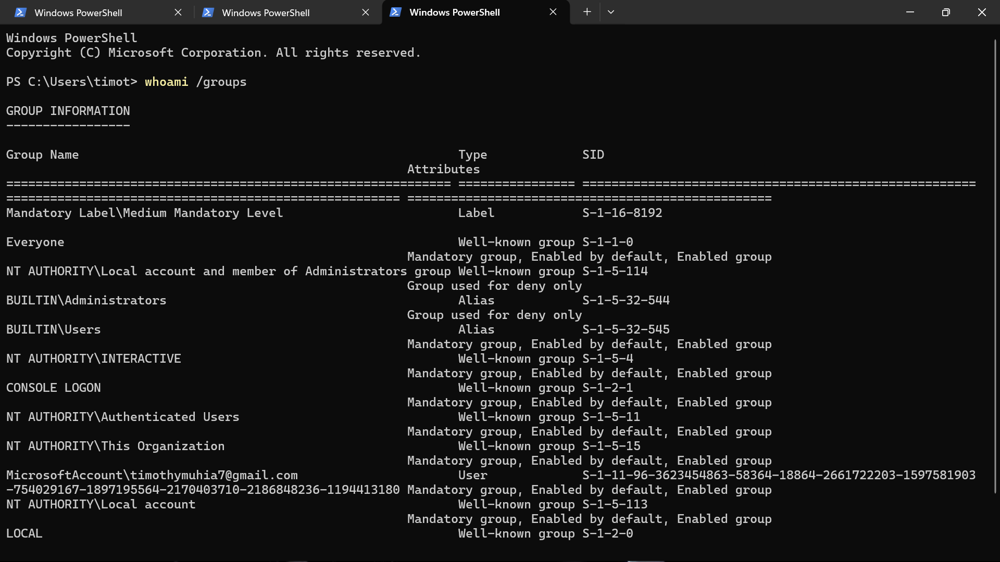
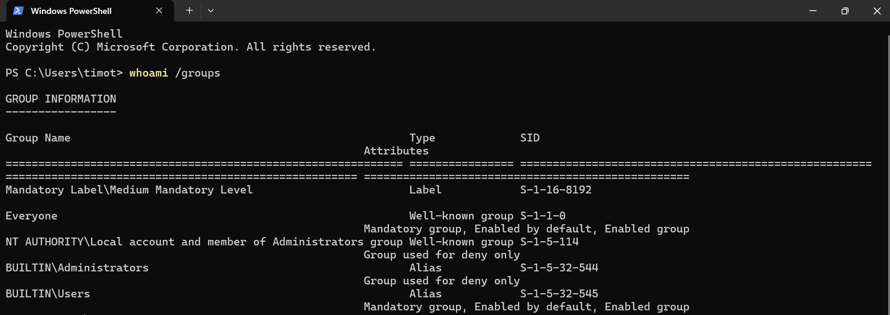
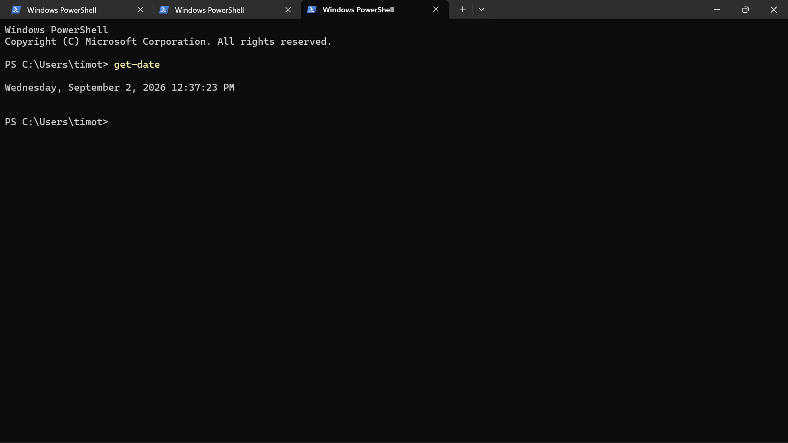
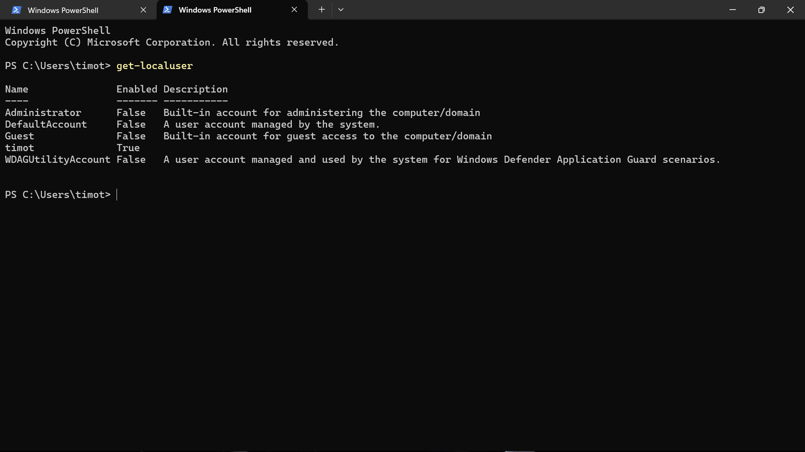
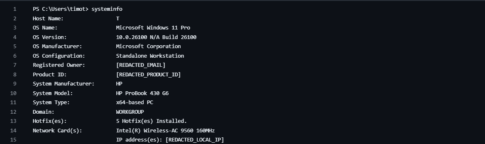

# Lab 01: Windows System Reconnaissance and Initial Triage

## Objective
Establish an operational security baseline of a target Windows host using native command-line and PowerShell utilities to gather system intelligence during initial incident triage.

## Environment
* **OS:** Windows 11 Pro (Build 26100)
* **Architecture:** x64 Workstation
* **Shell:** Windows PowerShell (Non-Elevated Context)
* **Lab Type:** SOC / Blue Team Triage

---

## SOC Investigation Log

### 1. Identity Verification (`whoami`)
* **Command:** `whoami`
* **Observation:** Active session context running under local account `[REDACTED_USER]`.
* **SOC Relevance:** Establishes initial user context to attribute process execution and file modifications during incident triage.

### 2. Group Membership & Integrity Level (`whoami /groups`)
* **Command:** `whoami /groups`
* **Observation:** Session running under `Medium Mandatory Level` (`S-1-16-8192`); member of `BUILTIN\Administrators` (`S-1-5-32-544`) with deny-only attributes applied via UAC.
* **SOC Relevance:** Identifies execution privileges and token integrity level to determine if privilege escalation is required to access protected system artifacts.

### 3. Investigation Timestamp (`Get-Date`)
* **Command:** `Get-Date`
* **Observation:** Recorded system timestamp at execution time.
* **SOC Relevance:** Establishes temporal anchor for log timeline normalization across endpoint, firewall, and SIEM records.

### 4. Host Architecture & Network Profile (`systeminfo`)
* **Command:** `systeminfo`
* **Observation:** Windows 11 Pro, WORKGROUP environment, hotfixes installed, active Wi-Fi interface, and secondary virtual adapters.
* **SOC Relevance:** Uncovers patch baseline, virtualization capabilities, and active network interfaces.

### 5. Local Account Enumeration (`Get-LocalUser`)
* **Command:** `Get-LocalUser`
* **Observation:** Standard built-in accounts disabled; only one active local user present.
* **SOC Relevance:** Uncovers potential unauthorized local user account creation or persistence mechanisms.

---

## Command Evidence

| Investigation Stage | Output Evidence | Triage Purpose |
| :--- | :--- | :--- |
| **01. Session Identity** |  | User context & domain mapping |
| **02. Group Privileges** |  | Privilege levels & UAC status |
| **03. Timeline Anchor** |  | Forensic temporal sync |
| **04. Local Accounts** |  | Account status & persistence checks |
| **05. System Baseline** |  | OS build, hotfixes, & network interfaces |
